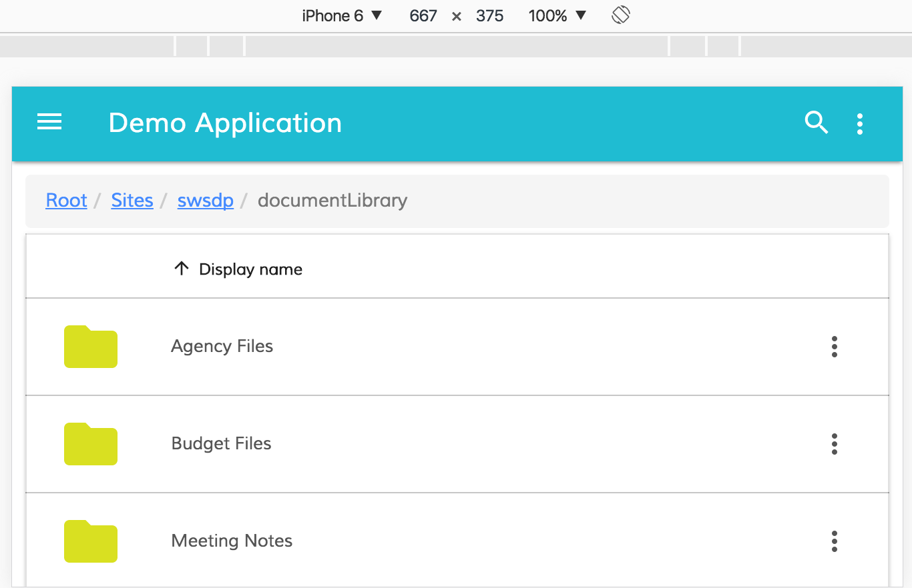
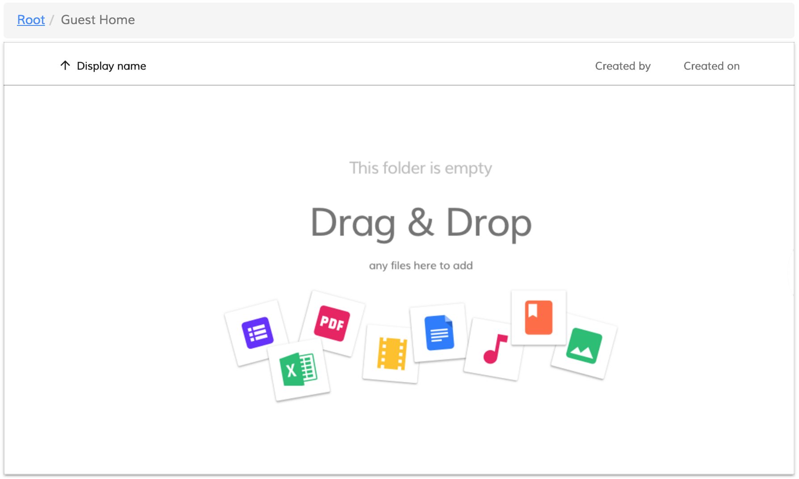

# Document List Component for Angular 2

<p>
  <a title='Build Status' href="https://travis-ci.com/Alfresco/alfresco-ng2-components">
    
  </a>
  <a href='https://coveralls.io/github/Alfresco/alfresco-ng2-components'>
    
  </a>
  <a href='https://github.com/Alfresco/alfresco-ng2-components/blob/master/LICENSE'>
     
  </a>
  <a href='https://www.alfresco.com/'>
     
  </a>
  <a href='https://angular.io/'>
     
  </a>
  <a href='https://www.typescriptlang.org/docs/tutorial.html'>
     
  </a>
  <a href='https://www.alfresco.com/'>
     
  </a>
</p>

### Node
To correctly use this component check that on your machine is running Node version 5.0.0 or higher.

## Install

```sh
npm install --save ng2-alfresco-documentlist
```

#### Dependencies

Add the following dependency to your index.html:

```html
<script src="node_modules/alfresco-js-api/bundle.js"></script>
```

The following component needs to be added to your systemjs.config: 

- ng2-translate
- ng2-alfresco-core
- ng2-alfresco-documentlist

Please refer to the following example to have an idea of how your systemjs.config should look like :

https://github.com/Alfresco/alfresco-ng2-components/blob/master/ng2-components/ng2-alfresco-documentlist/demo/systemjs.config.js

#### Style
The style of this component is based on material design, so if you want to visualize it correctly you have to add the material
design dependency to your project:

```sh
npm install --save material-design-icons material-design-lite
```

Also make sure you include these dependencies in your .html page:

```html
<!-- Google Material Design Lite -->
<link rel="stylesheet" href="node_modules/material-design-lite/material.min.css">
<script src="node_modules/material-design-lite/material.min.js"></script>
<link rel="stylesheet" href="node_modules/material-design-icons/iconfont/material-icons.css">
```


## Basic usage

```html
<alfresco-document-list
    [breadcrumb]="breadcrumb"
    [navigate]="navigation"
    (itemClick)="onItemClick($event)">
</alfresco-document-list>
```

Example of the component that declares document list and provides values for bindings:

```ts
import { Component, OnInit } from '@angular/core';
import { bootstrap } from '@angular/platform-browser-dynamic';
import { HTTP_PROVIDERS } from '@angular/http';

import {
    ALFRESCO_CORE_PROVIDERS,
    AlfrescoSettingsService,
    AlfrescoAuthenticationService,
    AlfrescoPipeTranslate,
    AlfrescoTranslationService,
    CONTEXT_MENU_DIRECTIVES
} from 'ng2-alfresco-core';

import {
    DOCUMENT_LIST_DIRECTIVES,
    DOCUMENT_LIST_PROVIDERS,
    DocumentActionsService
} from 'ng2-alfresco-documentlist';

@Component({
    selector: 'alfresco-documentlist-demo',
    template: `
        <div class="container">
            <alfresco-document-list [breadcrumb]="true"  *ngIf="authenticated">
            </alfresco-document-list>
        </div>
    `,
    styles: [':host > .container {padding: 10px}'],
    directives: [DOCUMENT_LIST_DIRECTIVES],
    providers: [DOCUMENT_LIST_PROVIDERS],
    pipes: [AlfrescoPipeTranslate]
})
class DocumentListDemo implements OnInit {

    authenticated: boolean;

    constructor(private authService: AlfrescoAuthenticationService,
                settings: AlfrescoSettingsService,
                translation: AlfrescoTranslationService,
                documentActions: DocumentActionsService) {

        settings.host = 'http://myalfrescoip';
        translation.addTranslationFolder();
        documentActions.setHandler('my-handler', this.myDocumentActionHandler.bind(this));
    }

    ngOnInit() {
        this.login();
    }

    myDocumentActionHandler(obj: any) {
        window.alert('my custom action handler');
    }

    myCustomAction1(event) {
        alert('Custom document action for ' + event.value.displayName);
    }

    myFolderAction1(event) {
        alert('Custom folder action for ' + event.value.displayName);
    }

    login() {
        this.authService.login('admin', 'admin').subscribe(token => {
            this.authenticated = true;
        });
    }
}

bootstrap(DocumentListDemo, [
    HTTP_PROVIDERS,
    ALFRESCO_CORE_PROVIDERS
]);
```

Note the use of ```DOCUMENT_LIST_DIRECTIVES``` barrel that consolidates all the document list related directives together.
It gives you access to ```<document-actions>```, ```<folder-actions>``` and many other directives.
In addition ```DOCUMENT_LIST_PROVIDERS``` exports all primary services and providers needed for component to function.

### Breadcrumb

Document List provides simple breadcrumb element to indicate the current position within a navigation hierarchy.
It can be enabled via `breadcrumb` attribute:

```html
<alfresco-document-list [breadcrumb]="true">
</alfresco-document-list>
```


Parent folder button is not displayed when breadcrumb is enabled.

### Custom columns

It is possible to reorder, extend or completely redefine data columns displayed by the component.
By default special `$thumbnail` and `displayName` columns are rendered.

A custom set of columns can look like the following:

```html
<alfresco-document-list ...>
    <content-columns>
        <content-column source="$thumbnail" type="image"></content-column>
        <content-column title="Name" source="name" class="full-width name-column"></content-column>
        <content-column title="Created By" source="createdByUser.displayName"></content-column>
        <content-column title="Created On" source="createdAt" type="date" format="medium"></content-column>
    </content-columns>
</alfresco-document-list>
```


Binding to nested properties is also supported. Assuming you have the node structure similar to following:

```json
{
    "nodeRef": "workspace://SpacesStore/8bb36efb-c26d-4d2b-9199-ab6922f53c28",
    "nodeType": "cm:folder",
    "type": "folder",
    "location": {
        "repositoryId": "552ca13e-458b-4566-9f3e-d0f9c92facff",
        "site": "swsdp",
        "siteTitle": "Sample: Web Site Design Project"
    }
}
```

the binding value for the Site column to display location site will be `location.site`:

```html
<alfresco-document-list ...>
    <content-columns>
        <content-column source="$thumbnail" type="image"></content-column>
        <content-column title="Name" source="displayName" class="full-width name-column"></content-column>
        <content-column title="Site" source="location.site"></content-column>
    </content-columns>
</alfresco-document-list>
```

### Column definition

HTML attributes:

| Name | Type | Default | Description
| --- | --- | --- | --- |
| title | string | | Column title |
| sr-title | string | | Screen reader title, used only when `title` is empty |
| source | string | | Column source, example: `createdByUser.displayName` |
| class | string | | CSS class list, example: `full-width name-column` |
| type | string | text | Column type, text\|date\|number |
| format | string | | Value format pattern |

For `date` column type the [DatePipe](https://angular.io/docs/ts/latest/api/common/DatePipe-class.html) formatting is used.
For a full list of available `format` values please refer to [DatePipe](https://angular.io/docs/ts/latest/api/common/DatePipe-class.html) documentation.

### Actions

Document List supports declarative actions for Documents and Folders.
Each action can be bound to either default out-of-box handler or a custom behavior.
You can define both folder and document actions at the same time.

#### Menu actions

```html
<alfresco-document-list ...>
    <content-actions>

        <content-action
            target="document"
            type="menu"
            title="System action"
            handler="system2">
        </content-action>

        <content-action
            target="document"
            type="menu"
            title="Custom action"
            (execute)="myCustomAction1($event)">
        </content-action>

    </content-actions>
</alfresco-document-list>
```

```ts
export class MyView {
    // ...

    myCustomAction1(event) {
        alert('Custom document action for ' + event.value.displayName);
    }
}
```

All document actions with `type="menu"` are rendered as a dropdown menu as on the picture below:


#### Default action handlers

The following action handlers are provided out-of-box:

- Download (document)
- Delete (document, folder)

All system handler names are case-insensitive, `handler="download"` and `handler="DOWNLOAD"`
will trigger the same `download` action.

##### Download

Initiates download of the corresponding document file.

```html
<alfresco-document-list ...>
    <content-actions>

        <content-action
            target="document"
            type="menu"
            title="Download"
            handler="download">
        </content-action>

    </content-actions>
</alfresco-document-list>
```


#### Document action buttons

It is also possible to display most frequent actions within a separate buttons panel:

```html
<alfresco-document-list ...>
    <content-actions>

        <content-action
            target="document"
            type="button"
            icon="extension"
            handler="system1">
        </content-action>

        <content-action
            target="document"
            type="button"
            icon="thumb_up"
            handler="system2">
        </content-action>

    </content-actions>
</alfresco-document-list>
```

Button actions provide same support for system and custom handlers.


#### Folder actions

Folder actions have the same declaration as document actions except ```taget="folder"``` attribute value.

```html
<alfresco-document-list ...>
    <content-actions>

        <content-action
            target="folder"
            type="menu"
            title="Default folder action 1"
            handler="system1">
        </content-action>

        <content-action
            target="folder"
            type="menu"
            title="Custom folder action"
            (execute)="myFolderAction1($event)">
        </content-action>

    </content-actions>
</alfresco-document-list>
```

```ts
export class MyView {
    // ...

    myFolderAction1(event) {
        alert('Custom folder action for ' + event.value.displayName);
    }
}
```


#### Folder action buttons

Every folder action is rendered as a separate button.

```html
<alfresco-document-list ...>
    <content-actions>

        <content-action
            target="folder"
            type="button"
            icon="delete"
            title="Delete"
            handler="system1">
        </content-action>

    </content-actions>
</alfresco-document-list>
```


### Context Menu

DocumentList also provide integration for 'Context Menu Service' from the
`ng2-alfresco-core` library.

You can automatically turn all menu actions (for the files and folders) 
into context menu items like shown below:


Enabling context menu is very simple:

```ts
import {
    CONTEXT_MENU_DIRECTIVES,
    CONTEXT_MENU_PROVIDERS
} from 'ng2-alfresco-core';

import {
    DOCUMENT_LIST_DIRECTIVES,
    DOCUMENT_LIST_PROVIDERS
} from 'ng2-alfresco-documentlist';

@Component({
    selector: 'my-view',
    template: `
        <alfresco-document-list>...</alfresco-document-list>
        <context-menu-holder></context-menu-holder>
    `,
    directives: [DOCUMENT_LIST_DIRECTIVES, CONTEXT_MENU_DIRECTIVES],
    providers: [DOCUMENT_LIST_PROVIDERS, CONTEXT_MENU_PROVIDERS]
})
export class MyView {
}
```

This enables context menu items for documents and folders.

### Navigation mode

By default DocumentList component uses 'double-click' mode for navigation.
That means user will see the contents of the folder by double-clicking its name
or icon (similar Google Drive behaviour). However it is possible switching to 
other modes, like single-click navigation for example.
 
The following navigation modes are supported:

- click
- dblclick

The following example switches navigation to single clicks:

```html
<alfresco-document-list navigation-mode="click">
</alfresco-document-list>
```

### Events

Document List emits the following events:

| Name | Description |
| --- | --- |
| itemClick | emitted when user clicks a document list entry |
| itemDblClick | emitted when user double-clicks document a document list entry |
| folderChange | emitted once current display folder has changed |
| preview | emitted when user acts upon files with either single or double click (depends on `navigation-mode`), recommended for Viewer components integration  |

### itemClick event

Emitted when user clicks on document or folder.

```html
<alfresco-document-list (itemClick)="onItemClick($event)">
</alfresco-document-list>
```

```ts
export class MyView {
    ...
    onItemClick(e) {
        console.log(e.value);
    }
}
```

For the event `value` the full node info is provided, i.e.:

```json
{
   "nodeRef": "workspace://SpacesStore/8bb36efb-c26d-4d2b-9199-ab6922f53c28",
   "nodeType": "cm:folder",
   "type": "folder",
   "mimetype": "",
   "isFolder": true,
   "isLink": false,
   "fileName": "Agency Files",
   "displayName": "Agency Files",
   "status": "",
   "title": "Agency related files",
   "description": "This folder holds the agency related files for the project",
   "author": "",
   "createdOn": "2011-02-15T20:47:03.951Z",
   "createdBy": "Mike Jackson",
   "createdByUser": "mjackson",
   "modifiedOn": "2011-02-15T21:00:43.616Z",
   "modifiedBy": "Mike Jackson",
   "modifiedByUser": "mjackson"
}
```

_The content of the json above was reduced for the sake of simplicity._

### folderChange event

This event is emitted every time current folder is changed. 
Event handler gets the following data available:

- folder
- absolutePath
- relativePath

```html
<alfresco-document-list 
    (folderchange)="onFolderChanged($event)">
</alfresco-document-list>
```

```ts
export class MyView {
    ...
    onFolderChanged(e) {
        console.log(e.value);
        console.log(e.absolutePath);
        console.log(e.relativePath);
    }
}
```

## Advanced usage and customization

### Hiding columns on small screens

You can hide columns on small screens by means of custom CSS rules:

```css
@media all and (max-width: 768px) {

    alfresco-document-list >>> th.desktop-only .cell-value {
        display: none;
    }

    alfresco-document-list >>> td.desktop-only .cell-value {
        display: none;
    }
}
```

Now you can declare columns and assign `desktop-only` class where needed:

```html
<alfresco-document-list ...>
    <content-columns>
        
        <!-- always visible columns -->
        
        <content-column source="$thumbnail" type="image"></content-column>
        <content-column 
                title="Name" 
                source="name" 
                class="full-width name-column">
        </content-column>
        
        <!-- desktop-only columns -->
        
        <content-column
                title="Created by"
                source="createdByUser.displayName"
                class="desktop-only">
        </content-column>
        <content-column
                title="Created on"
                source="createdAt"
                type="date"
                format="medium"
                class="desktop-only">
        </content-column>
    </content-columns>
</alfresco-document-list>
```

**Desktop View**


**Mobile View**



### Custom 'empty folder' template

By default Document List provides the following content for the empty folder:



This can be changed by means of the custom html template:

```html
<alfresco-document-list ...>
    <empty-folder-content>
        <template>
            <h1>Sorry, no content here</h1>
        </template>
    </empty-folder-content>
</alfresco-document-list>
```

That will give the following output:


### Customizing default actions

It is possible extending or replacing the list of available system actions for documents and folders.
Actions for the documents and folders can be accessed via the following services:

- `DocumentActionsService`, document action menu and quick document actions
- `FolderActionsService`, folder action menu and quick folder actions

Example below demonstrates how a new action handler can be registered with the
`DocumentActionsService`.

```html
<alfresco-document-list ...>
    <content-actions>

        <content-action
            target="document"
            type="button"
            icon="account_circle"
            handler="my-handler">
        </content-action>

    </content-actions>
</alfresco-document-list>
```

You register custom handler called `my-handler` that will be executing `myDocumentActionHandler`
function each time upon being invoked.

```ts
import {
    DocumentActionsService
} from 'ng2-alfresco-documentlist';

export class MyView {

    constructor(documentActions: DocumentActionsService) {
        documentActions.setHandler(
            'my-handler',
            this.myDocumentActionHandler.bind(this)
        );
    }

    myDocumentActionHandler(obj: any) {
        window.alert('my custom action handler');
    }
}
```


Upon execution users will see the following dialog:


The same approach allows changing the way out-of-box action handlers behave.
Registering custom action with the name `download` replaces default one:

```ts
export class MyView {

    constructor(documentActions: DocumentActionsService) {
        documentActions.setHandler(
            'download',
            this.customDownloadBehavior.bind(this)
        );
    }

    customDownloadBehavior(obj: any) {
        window.alert('my custom download behavior');
    }
}
```

Typically you may want populating all your custom actions at the application root level or
by means of custom application service.

## Build from sources

Alternatively you can build component from sources with the following commands:

```sh
npm install
npm run build
```

### Build the files and keep watching for changes

```sh
$ npm run build:w
```
    
### Running unit tests

```sh
npm test
```

### Running unit tests in browser

```sh
npm test-browser
```

This task rebuilds all the code, runs tslint, license checks and other quality check tools 
before performing unit testing. 

### Code coverage

```sh
npm run coverage
```