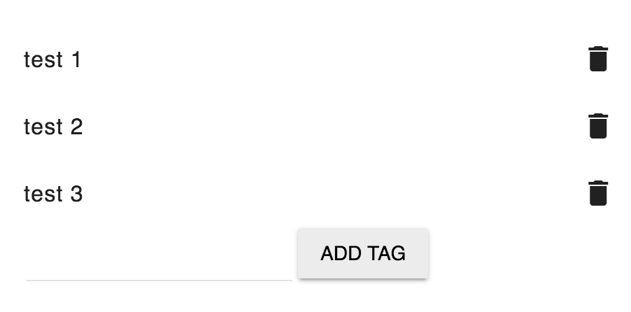
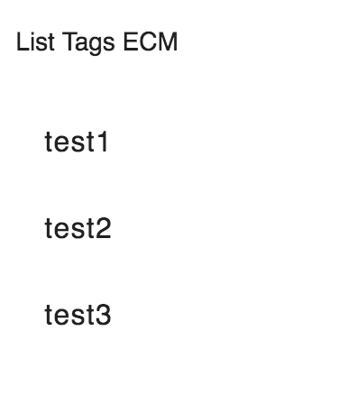

# Alfresco Tag Component for Angular 2

<p>
  <a title='Build Status Travis' href="https://travis-ci.org/Alfresco/alfresco-ng2-components">
    
  </a>
  <a title='Build Status AppVeyor' href="https://ci.appveyor.com/project/alfresco/alfresco-ng2-components">
    
  </a>
  <a href='https://codecov.io/gh/Alfresco/alfresco-ng2-components'>
    
  </a>
  <a href='https://www.npmjs.com/package/ng2-alfresco-tag'>
    
  </a>
  <a href='https://github.com/Alfresco/alfresco-ng2-components/blob/master/LICENSE'>
     
  </a>
  <a href='https://www.alfresco.com/'>
     
  </a>
  <a href='https://angular.io/'>
     
  </a>
  <a href='https://www.typescriptlang.org/docs/tutorial.html'>
     
  </a>
  <a href='https://www.alfresco.com/'>
     
  </a>
</p>

## Prerequisites

Before you start using this development framework, make sure you have installed all required software and done all the
necessary configuration [prerequisites](https://github.com/Alfresco/alfresco-ng2-components/blob/master/PREREQUISITES.md).

## Install

Follow the 3 steps below:

1. Npm

    ```sh
    npm install ng2-alfresco-tag --save
    ```

2. Html

    Include these dependencies in your index.html page:

    ```html

      <!-- Google Material Design Lite -->
      <link rel="stylesheet" href="node_modules/material-design-lite/material.min.css">
      <script src="node_modules/material-design-lite/material.min.js"></script>
      <link rel="stylesheet" href="node_modules/material-design-icons/iconfont/material-icons.css">

      <!-- Load the Angular Material 2 stylesheet -->
      <link href="node_modules/@angular/material/core/theming/prebuilt/deeppurple-amber.css" rel="stylesheet">

      <!-- Polyfill(s) for Safari (pre-10.x) -->
      <script src="node_modules/intl/dist/Intl.min.js"></script>
      <script src="node_modules/intl/locale-data/jsonp/en.js"></script>

      <!-- Polyfill(s) for older browsers -->
      <script src="node_modules/core-js/client/shim.min.js"></script>
      <script src="//cdnjs.cloudflare.com/ajax/libs/dom4/1.8.3/dom4.js"></script>
      <script src="node_modules/element.scrollintoviewifneeded-polyfill/index.js"></script>

      <!-- Polyfill(s) for dialogs -->
      <script src="node_modules/dialog-polyfill/dialog-polyfill.js"></script>
      <link rel="stylesheet" type="text/css" href="node_modules/dialog-polyfill/dialog-polyfill.css" />
      <style>._dialog_overlay { position: static !important; } </style>

      <!-- Modules  -->
      <script src="node_modules/zone.js/dist/zone.js"></script>
      <script src="node_modules/reflect-metadata/Reflect.js"></script>
      <script src="node_modules/systemjs/dist/system.src.js"></script>

    ```

3. SystemJs

    Add the following components to your systemjs.config.js file:

    - ng2-translate
    - alfresco-js-api
    - ng2-alfresco-core
    - ng2-alfresco-tag

    Please refer to the following example file: [systemjs.config.js](demo/systemjs.config.js) .


#### Basic usage

In this component are present three different tags :

* alfresco-tag-node-actions-list
* alfresco-tag-list
* alfresco-tag-node-list

## alfresco-tag-node-actions-list

```html
<alfresco-tag-node-actions-list [nodeId]="nodeId"></alfresco-tag-node-actions-list>
```  

```ts
import { NgModule, Component, Input } from '@angular/core';
import { BrowserModule } from '@angular/platform-browser';
import { platformBrowserDynamic } from '@angular/platform-browser-dynamic';

import { CoreModule, AlfrescoSettingsService, AlfrescoAuthenticationService } from 'ng2-alfresco-core';
import { TagModule } from 'ng2-alfresco-tag';

@Component({
    selector: 'alfresco-app-demo',
    template: `<alfresco-tag-node-actions-list [nodeId]="'74cd8a96-8a21-47e5-9b3b-a1b3e296787d'"></alfresco-tag-node-actions-list>
    `
})
class TagDemo {

    constructor(private authService: AlfrescoAuthenticationService, private settingsService: AlfrescoSettingsService) {
        settingsService.ecmHost = 'http://localhost:8080';

        this.authService.login('admin', 'admin').subscribe(
            ticket => {
                console.log(ticket);
            },
            error => {
                console.log(error);
            });
    }
}

@NgModule({
    imports: [
        BrowserModule,
        CoreModule.forRoot(),
        TagModule
    ],
    declarations: [ TagDemo ],
    bootstrap:    [ TagDemo ]
})
export class AppModule { }

platformBrowserDynamic().bootstrapModule(AppModule);
```  
 
### Options

Attribute     | Options     | Default      | Description | Mandatory
---           | ---         | ---          | ---         | ---
`nodeId`         | *string*    |        | The identifier of a node.| 

                         

## alfresco-tag-node-list

```html
<alfresco-tag-node-list [nodeId]="nodeId"></alfresco-tag-node-list>
``` 

```ts
import { NgModule, Component } from '@angular/core';
import { BrowserModule } from '@angular/platform-browser';
import { platformBrowserDynamic } from '@angular/platform-browser-dynamic';

import { CoreModule, AlfrescoSettingsService, AlfrescoAuthenticationService } from 'ng2-alfresco-core';
import { TagModule } from 'ng2-alfresco-tag';

@Component({
    selector: 'alfresco-app-demo',
    template: `<alfresco-tag-node-list [nodeId]="'74cd8a96-8a21-47e5-9b3b-a1b3e296787d'"></alfresco-tag-node-list>
    `
})
class TagDemo {

    constructor(private authService: AlfrescoAuthenticationService, private settingsService: AlfrescoSettingsService) {
        settingsService.ecmHost = 'http://localhost:8080';

        this.authService.login('admin', 'admin').subscribe(
            ticket => {
                console.log(ticket);
            },
            error => {
                console.log(error);
            });
    }
}

@NgModule({
    imports: [
        BrowserModule,
        CoreModule.forRoot(),
        TagModule
    ],
    declarations: [ TagDemo ],
    bootstrap:    [ TagDemo ]
})
export class AppModule { }

platformBrowserDynamic().bootstrapModule(AppModule);
```  

### Options

Attribute     | Options     | Default      | Description | Mandatory
---           | ---         | ---          | ---         | ---
`nodeId`         | *string*    |        | The identifier of a node.| 

                         

## alfresco-tag-list

```html
<alfresco-tag-list></alfresco-tag-list>
``` 

```ts
import { NgModule, Component } from '@angular/core';
import { BrowserModule } from '@angular/platform-browser';
import { platformBrowserDynamic } from '@angular/platform-browser-dynamic';

import { CoreModule, AlfrescoSettingsService, AlfrescoAuthenticationService } from 'ng2-alfresco-core';
import { TagModule } from 'ng2-alfresco-tag';

@Component({
    selector: 'alfresco-app-demo',
    template: `<alfresco-tag-list></alfresco-tag-list>`
})
class TagDemo {

    constructor(private authService: AlfrescoAuthenticationService, private settingsService: AlfrescoSettingsService) {
        settingsService.ecmHost = 'http://localhost:8080';

        this.authService.login('admin', 'admin').subscribe(
            ticket => {
                console.log(ticket);
            },
            error => {
                console.log(error);
            });
    }
}

@NgModule({
    imports: [
        BrowserModule,
        CoreModule.forRoot(),
        TagModule
    ],
    declarations: [ TagDemo ],
    bootstrap:    [ TagDemo ]
})
export class AppModule { }

platformBrowserDynamic().bootstrapModule(AppModule);
```  

                         

        
## Build from sources

Alternatively you can build component from sources with the following commands:


```sh
npm install
npm run build
```

### Build the files and keep watching for changes

```sh
$ npm run build:w
```

## Running unit tests

```sh
npm test
```

### Running unit tests in browser

```sh
npm test-browser
```

This task rebuilds all the code, runs tslint, license checks and other quality check tools
before performing unit testing.

### Code coverage

```sh
npm run coverage
```

## Demo

If you want have a demo of how the component works, please check the demo folder :

```sh
cd demo
npm install
npm start
```

## NPM scripts

| Command | Description |
| --- | --- |
| npm run build | Build component |
| npm run build:w | Build component and keep watching the changes |
| npm run test | Run unit tests in the console |
| npm run test-browser | Run unit tests in the browser
| npm run coverage | Run unit tests and display code coverage report |

## License

[Apache Version 2.0](https://github.com/Alfresco/alfresco-ng2-components/blob/master/LICENSE)
