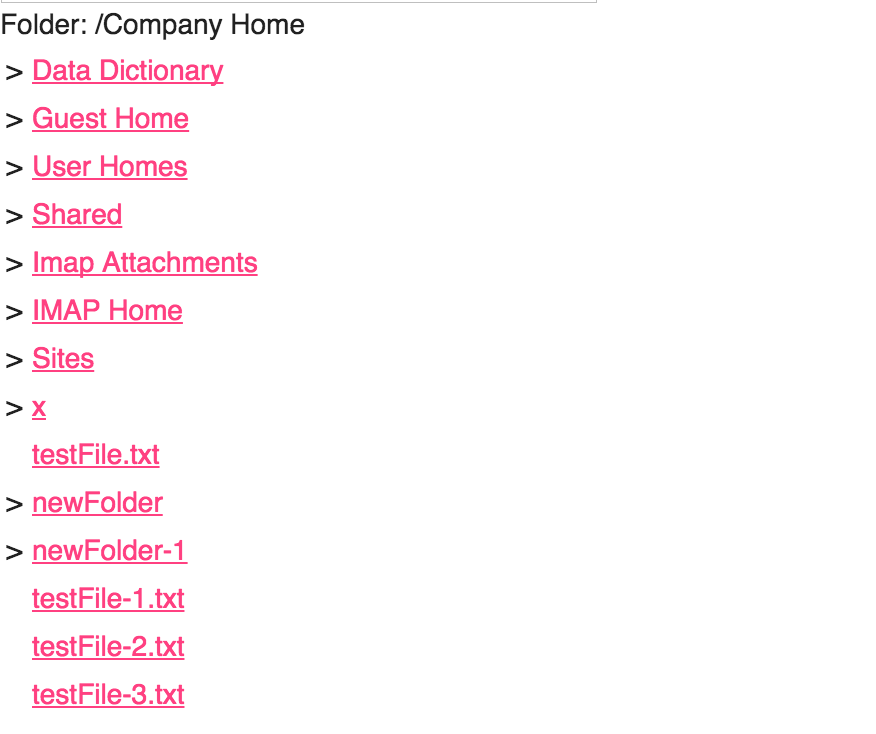

# Alfresco Webscript Component for Angular 2
<p>
  <a title='Build Status Travis' href="https://travis-ci.org/Alfresco/alfresco-ng2-components">
    
  </a>
  <a title='Build Status AppVeyor' href="https://ci.appveyor.com/project/alfresco/alfresco-ng2-components">
    
  </a>
  <a href='https://codecov.io/gh/Alfresco/alfresco-ng2-components'>
    
  </a>
  <a href='https://www.npmjs.com/package/ng2-alfresco-webscript'>
    
  </a>
  <a href='https://github.com/Alfresco/alfresco-ng2-components/blob/master/LICENSE'>
     
  </a>
  <a href='https://www.alfresco.com/'>
     
  </a>
  <a href='https://angular.io/'>
     
  </a>
  <a href='https://www.typescriptlang.org/docs/tutorial.html'>
     
  </a>
  <a href='https://www.alfresco.com/'>
     
  </a>
</p>

### Node
To correctly use this component check that on your machine is running Node version 5.0.0 or higher.

## Install

```sh
npm install --save ng2-alfresco-webscript
```

Components included:

* Alfresco Webscript Component

#### Dependencies

Add the following dependency to your index.html:

```html
<script src="node_modules/alfresco-js-api/dist/alfresco-js-api.js"></script>
```

The following component needs to be added to your systemjs.config: 

- ng2-translate
- ng2-alfresco-core
- ng2-alfresco-datatable

Please refer to the following example to have an idea of how your systemjs.config should look like :

https://github.com/Alfresco/alfresco-ng2-components/blob/master/ng2-components/ng2-alfresco-webscript/demo/systemjs.config.js

#### Style
The style of this component is based on material design, so if you want to visualize it correctly you have to add the material
design dependency to your project:

```sh
npm install --save material-design-icons material-design-lite
```

Also make sure you include these dependencies in your .html page:

```html
<!-- Google Material Design Lite -->
<link rel="stylesheet" href="node_modules/material-design-lite/material.min.css">
<script src="node_modules/material-design-lite/material.min.js"></script>
<link rel="stylesheet" href="node_modules/material-design-icons/iconfont/material-icons.css">
```

#### Basic usage


```html
 <alfresco-webscript-get [scriptPath]="string"
                         [scriptArgs]="Object"
                         [contextRoot]="string"
                         [servicePath]="string"
                         [showData]="boolean"
                         [contentType]="JSON | HTML | DATATABLE | TEXT"
                         (onSuccess)= "logData($event)">
 </alfresco-webscript-get>
 ```

Example of an App that use Alfresco webscript component :

main.ts
```ts

import { Component } from '@angular/core';
import { bootstrap } from '@angular/platform-browser-dynamic';
import { HTTP_PROVIDERS } from '@angular/http';

import {
    ALFRESCO_CORE_PROVIDERS,
    AlfrescoSettingsService,
    AlfrescoAuthenticationService
} from 'ng2-alfresco-core';

import { WEBSCRIPTCOMPONENT } from 'ng2-alfresco-webscript';

@Component({
    selector: 'my-app',
    template: `
    <alfresco-webscript-get [scriptPath]="scriptPath"
                               [scriptArgs]="scriptArgs"
                               [contextRoot]="contextRoot"
                               [servicePath]="servicePath" 
                               [contentType]="'HTML'">
    </alfresco-webscript-get>`,
    directives: [WEBSCRIPTCOMPONENT]
})
export class AppComponent {

    scriptPath: string = 'sample/folder/Company%20Home';

    contextRoot: string = 'alfresco';

    servicePath: string = 'service';
    
    constructor(public auth: AlfrescoAuthenticationService,
                alfrescoSettingsService: AlfrescoSettingsService) {
        alfrescoSettingsService.host = 'http://myalfrescoip';
    }
}

bootstrap(AppComponent, [
    HTTP_PROVIDERS,
    ALFRESCO_CORE_PROVIDERS
]);

```

#### Options


Attribute     | Options     | Default      | Description | Mandatory
---           | ---         | ---          | ---         | ---
`scriptPath`         | *string*    |        |  path to Web Script (as defined by Web Script) | mandatory
`scriptArgs`         | *Object*    |        |  arguments to pass to Web Script | 
`contextRoot`         | *string*    |        |  path where application is deployed | 
`scriptPath`         | *string*    |        |  path to Web Script (as defined by Web Script) | alfresco
`contentType`         | *string*    |        |  path where Web Script service is mapped default value | service
`contentType`         | *string*    |        |  how to handle the data received from te web script JSON , HTML , DATATABLE or TEXT | TEXT
`onSuccess`         | *event*   |        |  You can get the plain data from the webscript through the **onSuccess** event parameter and use it as you need in your application |
`showData`         | *booleann*   |        |  render the webscript data |true


**contentType** {string}  
***data***      {string}  data contain the plain value get from the webscipt is an output parameter

## Webscript View HTML example
This sample demonstrates how to implement a Webscript component that renders the HTML contents that come from a webscript
This sample Web Scripts  reside in your Alfresco Server AND  you can access the folder webscript here:

http://localhost:8080/alfresco/service/sample/folder/Company%20Home 


```html
 <alfresco-webscript-get [scriptPath]="scriptPath"
                           [contextRoot]= "'alfresco'"
                           [servicePath]= "'service'";
                           [scriptPath]=  "'Sample/folder/Company%20Home'"
                           [contentType]= "'HTML'">
 </alfresco-webscript-get>
```                          

                         

## Webscript View DATATABLE example
This sample demonstrates how to implement a Webscript component that renders the JSON contents that come from a webscript

http://localhost:8080/alfresco/service/sample/folder/DATATABLE

```html
 <alfresco-webscript-get [scriptPath]="scriptPath"
                           [contextRoot]= "'alfresco'"
                           [servicePath]= "'service'";
                           [scriptPath]=  "'Sample/folder/DATATABLE'"
                           [contentType]= "'DATATABLE'">
 </alfresco-webscript-get>
```  

If you want show the result from a webscript inside a ng2-alfresco-datatable you have to return from the GET of the webscript the datatructure below:
subdivide in data and schema

```ts
data: [],
schema: []
```

this is an example: 

```ts
data: [
    {id: 1, name: 'Name 1'},
    {id: 2, name: 'Name 2'}
],
schema: [{
    type: 'text',
    key: 'id',
    title: 'Id',
    sortable: true
}, {
    type: 'text',
    key: 'name',
    title: 'Name',
    sortable: true
}]
```

or you can send just the array data and the component will create a schema for you: 

```ts
data: [
    {id: 1, name: 'Name 1'},
    {id: 2, name: 'Name 2'}
]]
```

that will render the follow table


## Webscript View JSON example
This sample demonstrates how to implement a Webscript component that renders the JSON contents that come from a webscript
This sample Web Scripts  reside in your Alfresco Server AND  you can access the folder webscript here:

http://localhost:8080/alfresco/service/sample/folder/JSON%EXAMPLE 

```html
 <alfresco-webscript-get [scriptPath]="scriptPath"
                           [contextRoot]= "'alfresco'"
                           [servicePath]= "'service'";
                           [scriptPath]=  "'Sample/folder/JSON_EXAMPLE'"
                           [contentType]= "'HTML'"
                           [showData] = "false"
                           (onSuccess)= "logDataExample($event)">
 </alfresco-webscript-get>
``` 

You can get the plain data from the webscript through the **onSuccess** event parameter and use it as you need in your application

```ts
    logDataExample(data) {
        console.log('You webscript data are here' + data);
    }
```

        
## Build from sources
Alternatively you can build component from sources with the following commands:
     
     
```sh
npm install
npm run build
```

##Build the files and keep watching for changes

```sh
npm run build:w
```
    
## Running unit tests

```sh
npm test
```

## Running unit tests in browser

```sh
npm test-browser
```

This task rebuilds all the code, runs tslint, license checks and other quality check tools 
before performing unit testing. 

## Code coverage

```sh
npm run coverage
```

## Demo

If you want have a demo of how the component works, please check the demo folder :

```sh
cd demo
npm install
npm start
```

